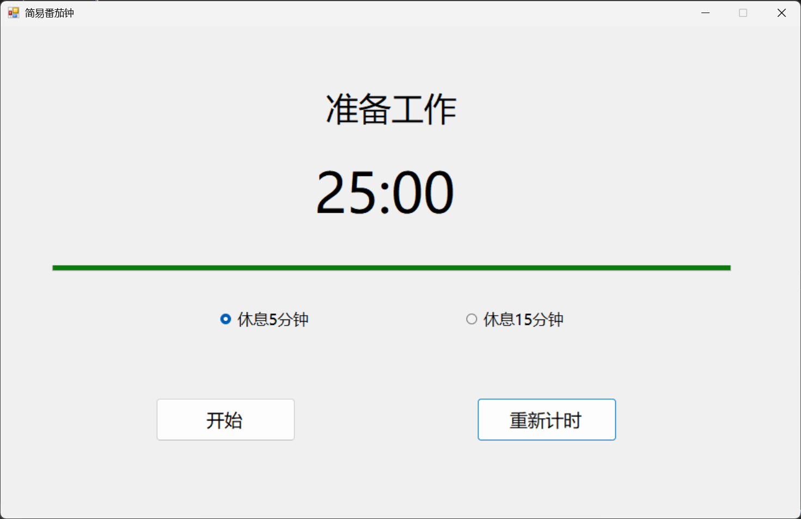

# Simple Pomodoro Timer (WinForms)

一个基于 .NET Framework 4.8 开发的超轻量级番茄钟工具。

## ✨ 特点
- **超轻量**：单文件仅几百 KB，无需安装，即点即用。
- **极简设计**：无多余干扰，专注于 25分钟工作流。
- **自动流转**：工作结束自动进入休息，休息结束自动回到工作。

## 📸 截图

## 🛠️ 开发环境
- Visual Studio 2022
- .NET Framework 4.8
- Windows Forms

## 🚀 如何使用
1. 在 [Releases](https://github.com/Wit-2k/Simple_Pomodoro/releases/) 页面下载最新版 exe。
2. 双击运行即可。

## 📄 License
MIT License
